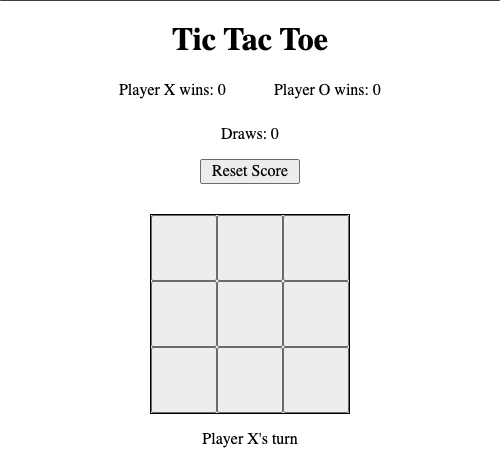

# 🎮 Tic Tac Toe Game – JavaScript Project

This is a simple web-based **Tic-Tac-Toe** game built with **HTML**, **CSS**, and **JavaScript**. It was created to practice working with DOM manipulation, event handling, game logic, procedural practices, and refactoring to object-oriented programming principles.

---

## 📌 Features

- Two-player mode (X vs O)  
- Detects wins and draws  
- Automatically resets after each game   

---

## 🧠 What I Learned

- How to manage game state using arrays and DOM elements  
- How to use event listeners to handle user interactions  
- How to check winning conditions using `.some()` and `.every()`  
- Practice with arrow functions and `this` context in JavaScript  

---

## 🚀 How to Run

1. Clone the repo or [download the ZIP](https://github.com/your-username/your-repo-name/archive/refs/heads/main.zip)
2. Open `index.html` in your browser
3. Play and enjoy the game!

---

## 🖼️ Screenshots 

---

## ✍️ Author

Created by **Alexis Bustos**  
Still learning, still building!

---

## ✅ Future Improvements Under Consideration (Stretch Goals)

- Add single-player mode with simple AI  
- Add animations or sound effects  
- Improve UI/UX with better styling  
- Highlight the winning combination  
- Mobile responsiveness 